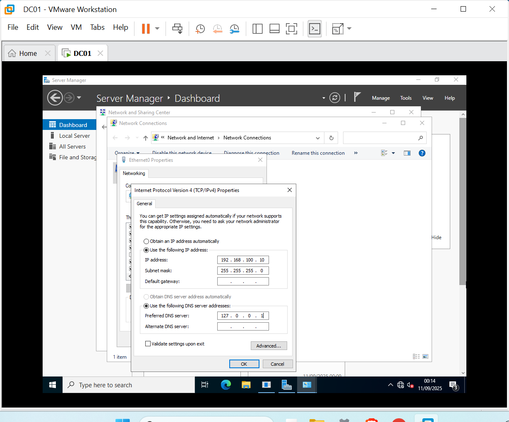
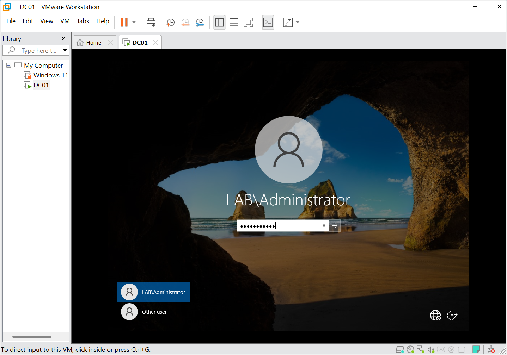
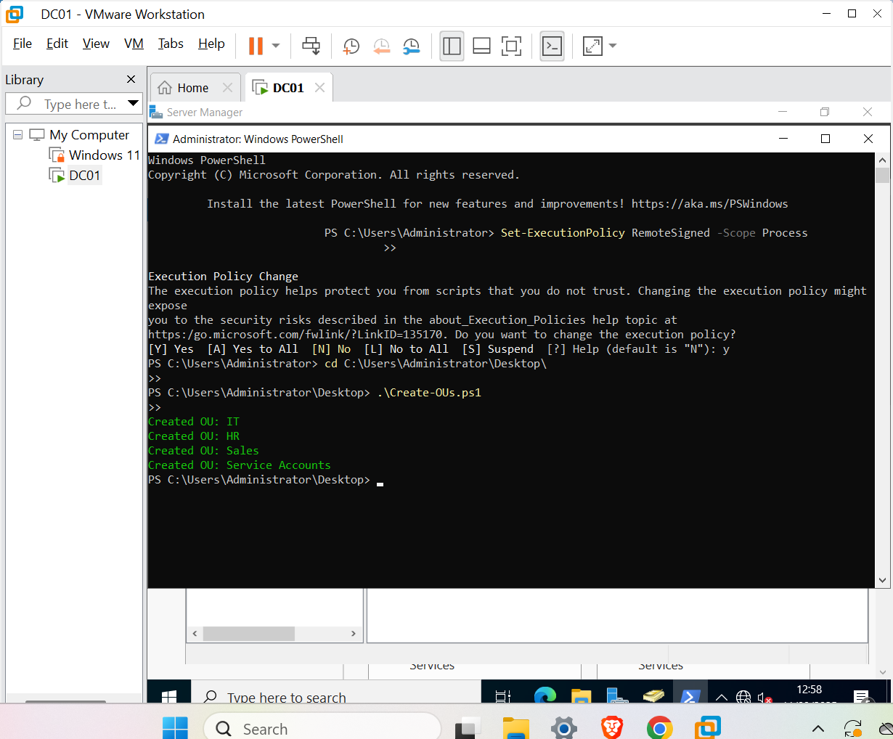
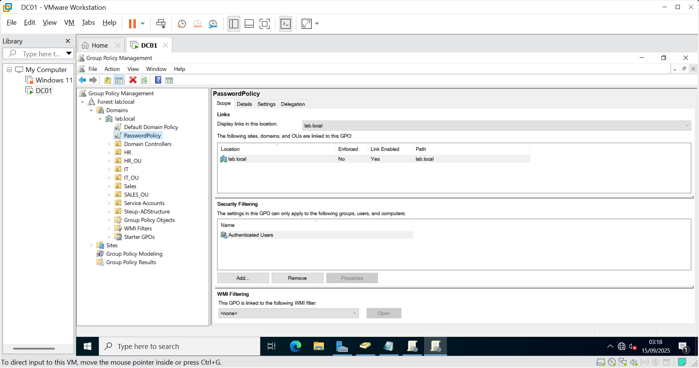
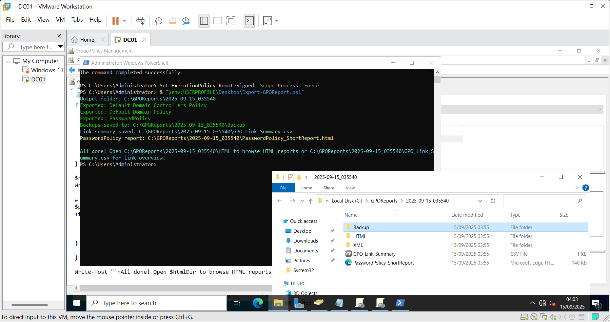

# Active Directory Homelab (Windows Server)

👤 **Author:** Kingsley Otoo  
🔗 [LinkedIn](https://www.linkedin.com/in/kingsley-otoo-6aabb0273) | [GitHub Repository](https://github.com/Tygun02/ActiveDirectory-Lab-Homelab)

---

## 📌 Overview
This project showcases my hands-on experience setting up an **Active Directory (AD) environment** in a VMware homelab.  
I built and configured a Windows Server domain controller, automated administration with PowerShell, and applied security best practices.

---

## ⭐ Key Skills Demonstrated
- Windows Server installation and promotion to **Domain Controller (AD DS)**  
- DNS configuration and domain networking  
- **Organizational Unit (OU)** hierarchy design  
- Automated **user and group creation** with PowerShell  
- Group Policy Objects (**GPOs**) for password complexity & security  
- Backup and documentation of domain policies  

---

## 📂 Project Deliverables
- Full walkthrough with screenshots (`docs/`)  
- PowerShell automation scripts (`scripts/`)  
- Backup & GPO export files  

---

## 📄 Portfolio Downloads

- 📘 [Full Portfolio (Detailed with Screenshots)](./ActiveDirectoryHomelabPortfolio)  
- ⚡ [Executive Summary (1-page overview)](./ActiveDirectoryHomelabSummary)

---

## 🚀 Why This Matters
This homelab demonstrates not only technical skills in **Active Directory administration**, but also my ability to:  
✔️ Document clearly  
✔️ Automate repetitive tasks  
✔️ Follow security best practices  
✔️ Present professional reports for stakeholders  

---

## 🔗 Connect
📧 Reach me on [LinkedIn](https://www.linkedin.com/in/kingsley-otoo-6aabb0273).  

# Active Directory Homelab (Windows Server)

👤 **Author:** Kingsley Otoo  
🔗 [LinkedIn](https://www.linkedin.com/in/kingsley-otoo-6aabb0273) | [GitHub Repository](https://github.com/Tygun02/ActiveDirectory-Lab-Homelab)

---

## 📌 Overview
This project showcases my hands-on experience setting up an **Active Directory (AD) environment** in a VMware homelab.  
I built and configured a Windows Server domain controller, automated administration with PowerShell, and applied security best practices.

---

## ⭐ Key Skills Demonstrated
- Windows Server installation and promotion to **Domain Controller (AD DS)**  
- DNS configuration and domain networking  
- **Organizational Unit (OU)** hierarchy design  
- Automated **user and group creation** with PowerShell  
- Group Policy Objects (**GPOs**) for password complexity & security  
- Backup and documentation of domain policies  

---

## 📂 Project Deliverables
- Full walkthrough with screenshots (`docs/`)  
- PowerShell automation scripts (`scripts/`)  
- Backup & GPO export files  

---

## 📄 Portfolio Downloads
- 📘 [Full Portfolio (Detailed with Screenshots)](../ActiveDirectoryHomelab-Portfolio.pdf (2))  
- ⚡ [Executive Summary (1-page overview)](../ActiveDirectoryHomelab-Summary.pdf (1))  

---

## 🖼️ Screenshot Gallery

The following images highlight **key steps** of my Active Directory Homelab setup, from initial configuration to security hardening and backup.

| VM Settings | Static IP | AD Installation |
|-------------|-----------|-----------------|
|  _VMware VM settings summary_ |  _Static IP configuration_ |  _Active Directory DS installation_ |

| ADUC Console | OU Structure | PowerShell OUs |
|--------------|--------------|----------------|
|  _ADUC console open_ |  _Organizational Unit (OU) hierarchy_ |  _PowerShell automation creating OUs_ |

| GPO Password Policy | Backup Report |
|---------------------|---------------|
|  _Group Policy enforcing password rules_ |  _Backup and export report_ |

📘 [View Full Portfolio with All Screenshots (PDF)](../ActiveDirectoryHomelab-Portfolio.pdf)  
⚡ [Download 1-Page Executive Summary (PDF)](../ActiveDirectoryHomelab-Summary.pdf)  

---

## 🛠️ Skills Applied in This Project
- Windows Server 2022 installation & configuration  
- Active Directory Domain Services (AD DS) deployment  
- DNS configuration & static IP networking  
- Organizational Unit (OU) & user/group management  
- PowerShell automation for bulk tasks  
- Group Policy Objects (GPOs) for security baselines  
- Backup, reporting, and documentation best practices  

---

## 🔗 Connect
📧 Reach me on [LinkedIn](https://www.linkedin.com/in/kingsley-otoo-6aabb0273).  

