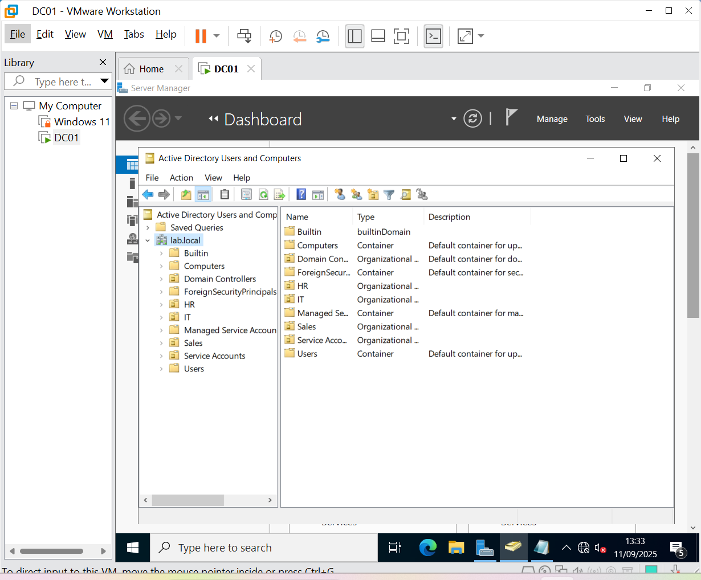

# Active Directory Homelab (Windows Server)

Welcome to my **Active Directory (AD) homelab portfolio site**.  
This project demonstrates my ability to plan, deploy, and document a fully functional AD environment with automation and security best practices.

---

## 📌 Key Highlights
- ⚙️ Built a **Windows Server 2022 VM** and promoted it to a **Domain Controller**
- 🌐 Configured **DNS and networking** for domain services
- 🗂️ Designed a structured **OU hierarchy** (IT, HR, Sales)
- 👥 Automated **user and group creation** with PowerShell
- 🔒 Applied **Group Policy Objects (GPOs)** for password complexity & security baselines
- 📑 Exported **GPO reports and backups** for documentation

---

## 📄 Portfolio Downloads
- 📘 [View Full Portfolio with Screenshots (PDF)](ActiveDirectoryHomelab-Portfolio.pdf)  
- ⚡ [Download 1-Page Executive Summary (PDF)](ActiveDirectoryHomelab-Summary.pdf)

---

## 🖼️ Screenshot Gallery

The following images highlight **key steps** of my Active Directory Homelab setup, from initial configuration to security hardening and backup.

| VM Settings | Static IP | AD Installation |
|-------------|-----------|-----------------|
|  _VMware VM settings summary_ |  _Static IP configuration_ |  _Active Directory DS installation_ |

| ADUC Console | OU Structure | PowerShell OUs |
|--------------|--------------|----------------|
|  _ADUC console open_ |  _Organizational Unit (OU) hierarchy_ |  _PowerShell automation creating OUs_ |

| GPO Password Policy | Backup Report |
|---------------------|---------------|
|  _Group Policy enforcing password rules_ |  _Backup and export report_ |

---

## 🛠️ Skills Applied in This Project
- Windows Server 2022 installation & configuration  
- Active Directory Domain Services (AD DS) deployment  
- DNS configuration & static IP networking  
- Organizational Unit (OU) & user/group management  
- PowerShell automation for bulk tasks  
- Group Policy Objects (GPOs) for security baselines  
- Backup, reporting, and documentation best practices 

👤 **Author:** Kingsley Otoo  
🔗 [LinkedIn Profile](https://www.linkedin.com/in/kingsley-otoo-6aabb0273)  

# Active Directory Homelab (Windows Server)

👤 **Author:** Kingsley Otoo  
🔗 [LinkedIn](https://www.linkedin.com/in/kingsley-otoo-6aabb0273) | [GitHub Repository](https://github.com/Tygun02/ActiveDirectory-Lab-Homelab)

---

